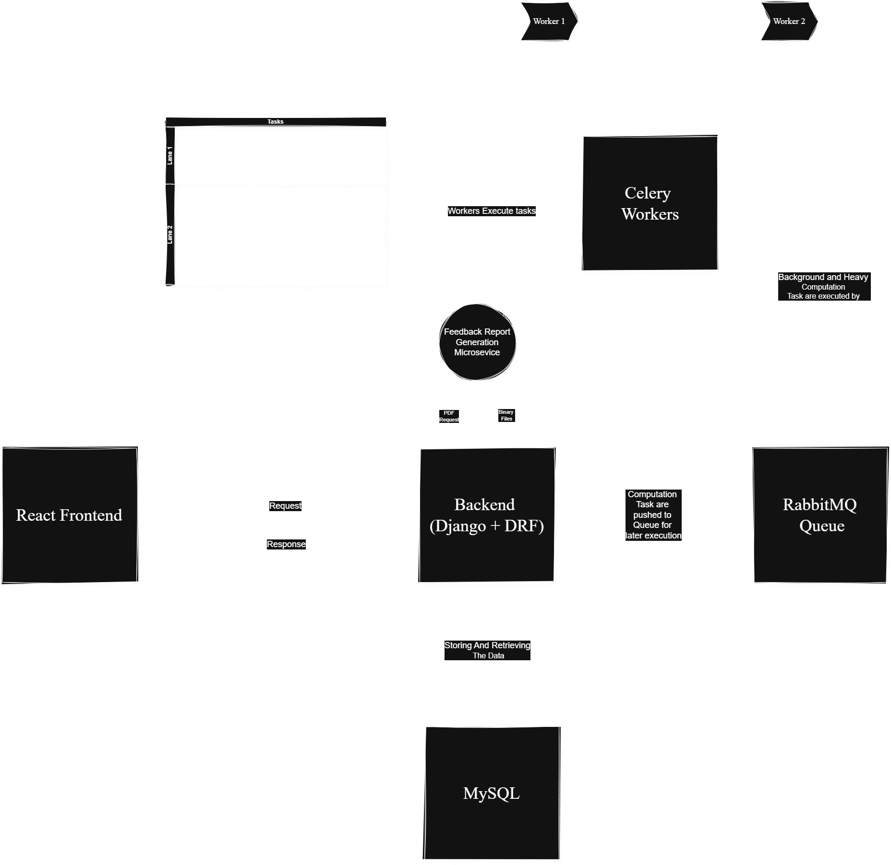

<p align="center">
  
</p>

# HiringDog Interview Platform

HDIP is an “Interview as a Service” platform which helps corporates to save their time and cost in the recruitment process. Also, HDIP helps in the offered candidate engagement till their joining through its advance engagement product.

# 🏗️ Architecture Document – Interviewers as a Platform

## 1. Overview

"Interviewers as a Platform" connects companies with vetted freelance interviewers for conducting remote interviews. The system supports candidate submission, scheduling, calendar integration, interview management, invoicing, and automated feedback generation using AI.

---

## 2. High-Level Architecture Diagram

```plaintext
[React Frontend] <---> [Django REST API] <--> [MySQL DB]
   |
   |--> [Celery Workers]
   |    |--> [RabbitMQ Queue]
   |    |--> [Email Service]
   |    |--> [Feedback Microservice (Cloud Run)]
   |
   |--> [Google Calendar API]
   |--> [Google Meet + Drive API]
   |--> [Cashfree Payment Gateway]
```

---

## 3. Key Components

### 🔹 Frontend (React)

- Candidate submission
- Interview slot picker
- Admin/client dashboards

### 🔹 Backend API (Django + DRF)

- Core business logic & authentication
- Exposes REST APIs for frontend
- Token-based (JWT) auth system

### 🔹 Celery + RabbitMQ

- Background tasks:
  - Email notifications
  - Interview reminders
  - Feedback generation
  - Video downloads from Drive
  - Invoice scheduling

### 🔹 MySQL

- Stores all relational data:
  - Users, interviews, schedules, payments

### 🔹 Feedback Microservice (Node.js)

- Generates PDF reports using Puppeteer
- Ruuning in same instance
- Called by backend when feedback is ready

### 🔹 Google APIs

- Calendar: Availability + booking
- Meet: Link generation & access control
- Drive: Video recording download

### 🔹 Cashfree Payment Gateway

- Used only for clients
- Monthly billing via backend API

---

## 4. Data Flow Examples

### 🕒 Interview Scheduling

1. Client submits candidate → Stored in DB.
2. Client opens scheduling link → Picks time slot.
3. Backend sends invite to all available interviewers.
4. First to accept → Interview is confirmed.
5. Google Meet link is generated.
6. Email confirmation sent to all parties.

### 📩 Reminder Notification

1. Celery Beat triggers scheduled task.
2. Task queries upcoming interviews.
3. Emails sent to interviewers & candidates.

---

## 5. Technology Stack

| Component     | Tech Used            |
| ------------- | -------------------- |
| Frontend      | React + Tailwind     |
| Backend       | Django + DRF         |
| Auth          | JWT                  |
| Queue         | RabbitMQ             |
| Background    | Celery               |
| Storage       | MySQL + GCS          |
| Cloud Infra   | GCP (VM + Cloud Run) |
| Payments      | Cashfree API         |
| AI Feedback   | Node.js + Puppeteer  |
| Calendar APIs | Google APIs          |

---

## 6. Environments

| Environment | Description                                     |
| ----------- | ----------------------------------------------- |
| Dev         | Local developer setups                          |
| Staging     | AWS                                             |
| Prod        | GCP VM (backend, PDF), Cloud MySQL Storage (DB) |

- Access to `.env`, secrets restricted via OS-level users.

---

## 7. Deployment Strategy

- **Backend (Django)**: Systemd + Gunicorn on GCP VM
- **Queue**: RabbitMQ (systemd service)
- **Scheduler**: Celery Beat (database scheduler)
- **Future Goals**:
  - Blue-green deploy with rollback
  - Slack CI/CD bot notifications
  - Auto-scaling Cloud Run for microservices

---

## 8. Notes

- Architecture evolves; this is v1.

## Run Locally

Clone the project

1. clone it by setting the ssh key

```bash
  git clone <ssh:link>
```

2. navigate to inner directory

```bash
  cd my-project
```

3. create a virtual environment

```bash
  python -m venv venv
```

4. activate the virtual environment

```bash
  source venv/bin/activate
```

5. install dependencies

```bash
  pip install -r requirements.txt
```

6. start the project

```bash
  python manage.py runserver
```

## Architecture Diagram


